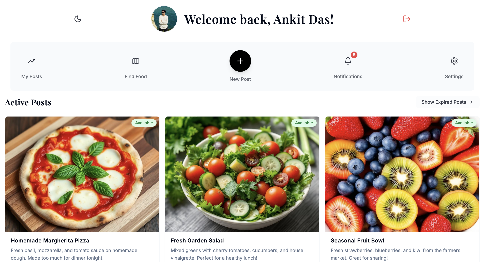
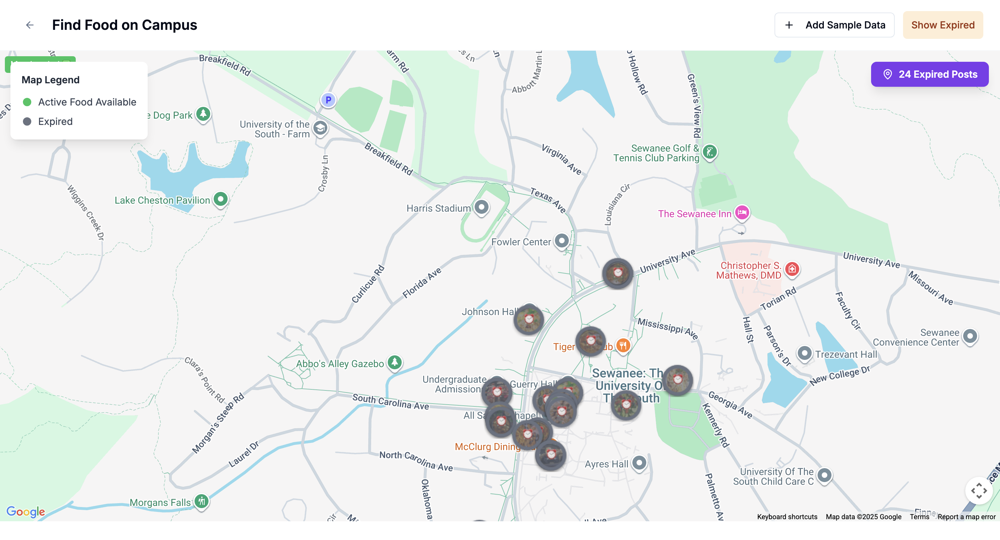
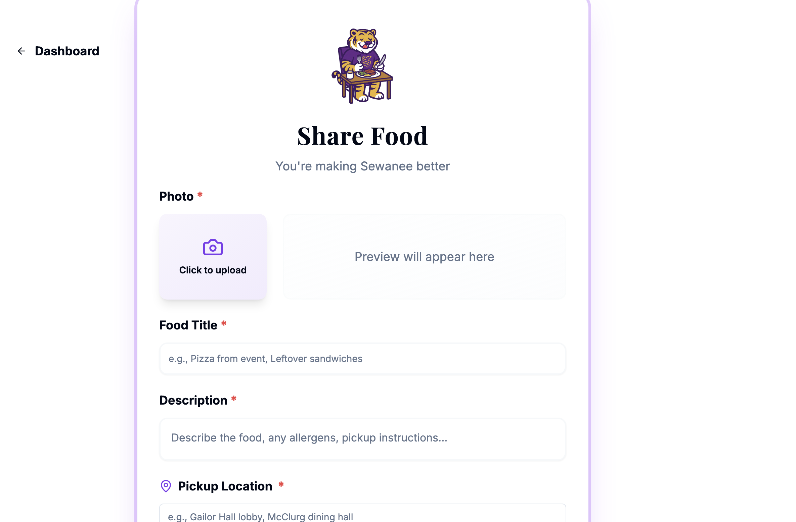
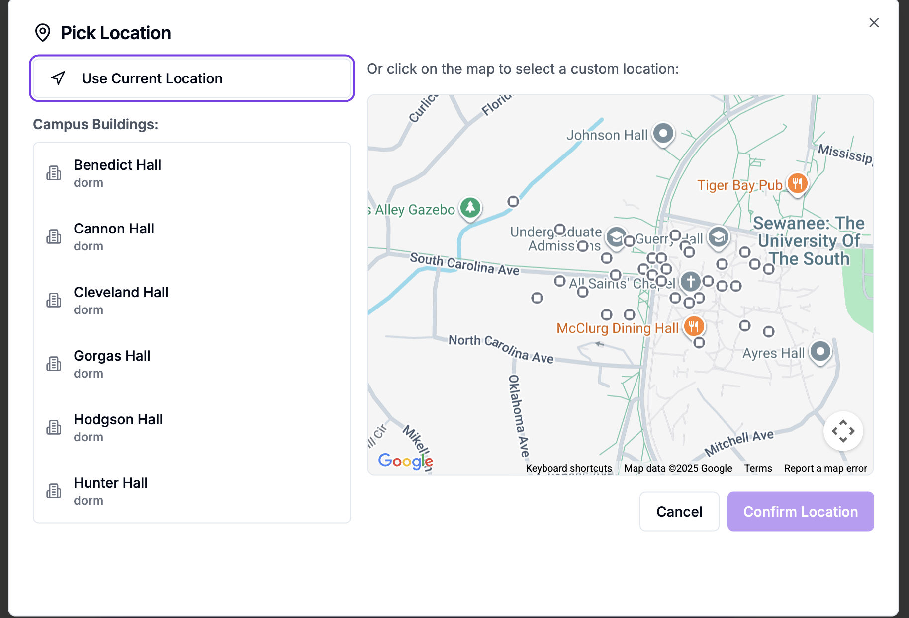
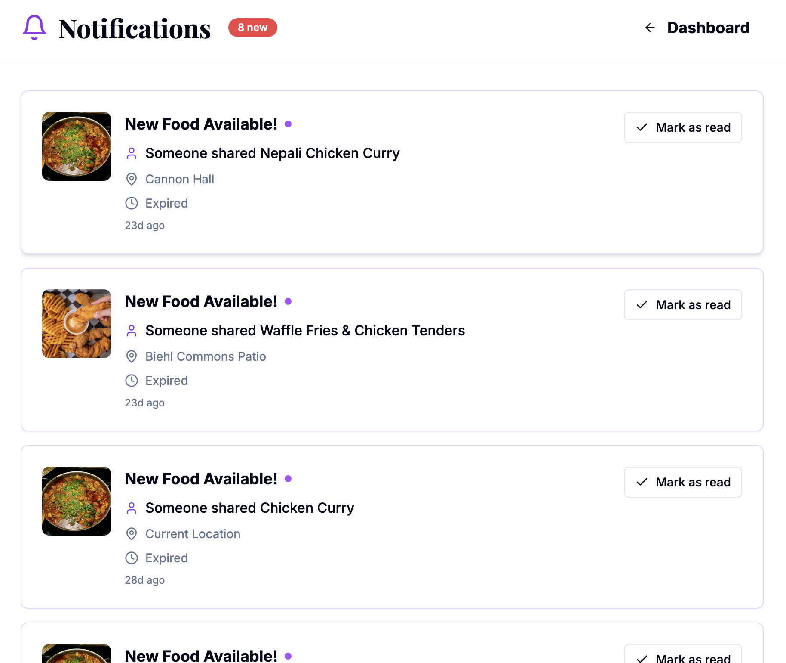
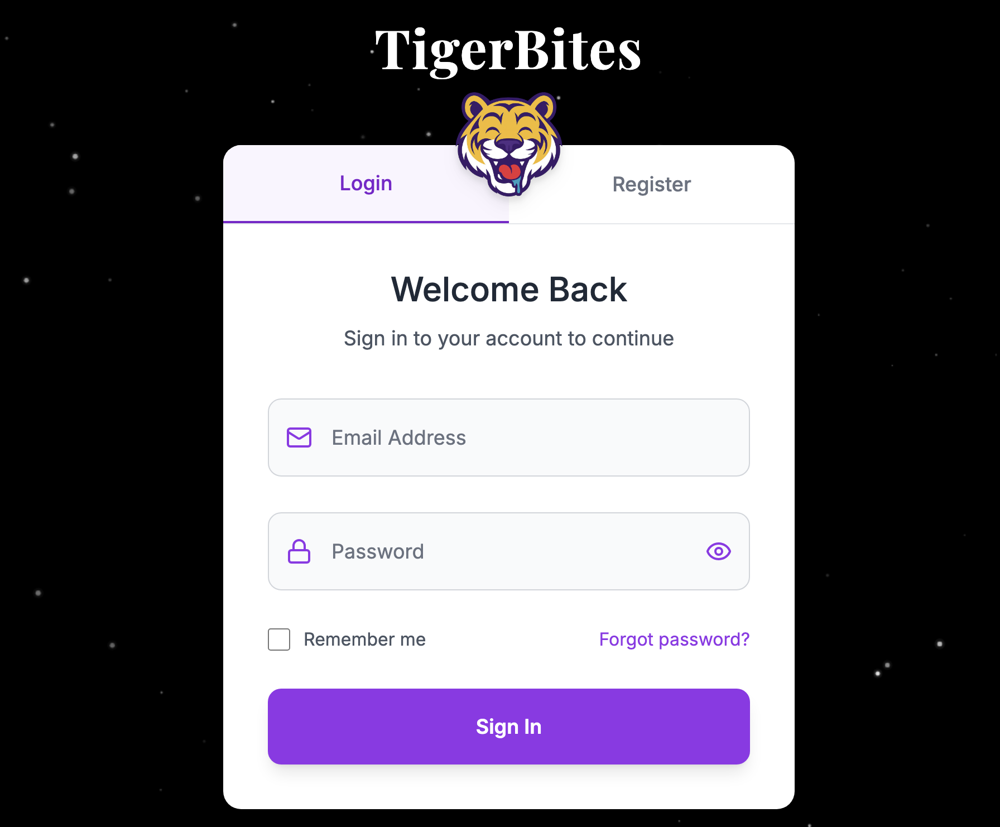
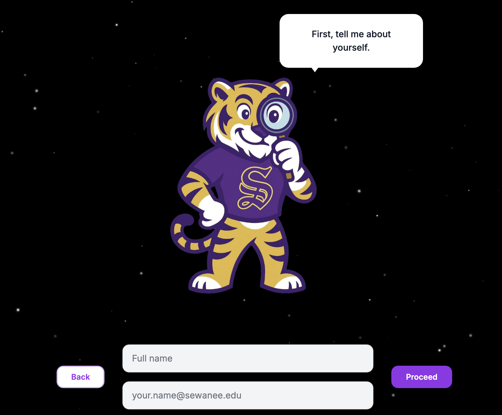

# Sewanee Food Share

A community-driven food sharing platform that connects students and faculty to reduce food waste and build stronger campus connections.

## About

Sewanee Food Share is a mobile-first web application currently used by users at the University of the South to share surplus food across campus. The platform aims to reduce food waste by 40% while fostering community connections through food sharing.

## Demo Screenshots

### Dashboard

*Main dashboard showing active food posts with real-time updates*

### Interactive Food Map

*Campus map displaying food locations with custom image markers*

### Share Food

*Food posting interface with location picker*

### Location Picker

*Interactive location selection with campus buildings*

### Notifications

*Real-time notifications for new food posts*

### Login Screen

*Authentication interface with TigerBites branding*

### Onboarding

*Interactive onboarding experience with Monte the Tiger mascot*

## Features

- **Interactive Food Map**: Real-time map displaying food locations with custom image markers showing actual food photos
- **Smart Food Posts**: Photo-based listings with expiration tracking, serving sizes, and pickup instructions
- **Community Engagement**: "Going" feature to indicate pickup interest and real-time notifications
- **Post Management**: Personal dashboard for managing posts with "Mark as Finished" functionality
- **Location-Based Discovery**: Campus building recognition and custom location selection
- **Progressive Web App**: Installable app experience with offline support and push notifications
- **Dark/Light Mode**: Theme support for comfortable viewing
- **Real-Time Updates**: Live synchronization using Supabase subscriptions

## Tech Stack

### Frontend
- **React** - UI library for building interactive interfaces
- **TypeScript** - Type-safe JavaScript for better developer experience
- **Vite** - Fast build tool and development server
- **Tailwind CSS** - Utility-first CSS framework for styling
- **Shadcn/ui** - High-quality, accessible component library

### Backend & Database
- **Supabase** - Backend-as-a-Service platform
  - PostgreSQL database with real-time subscriptions
  - Row-level security (RLS) policies
  - Authentication and user management
  - File storage for food images

### Maps & Location
- **Google Maps JavaScript API** - Interactive maps and location services
- **Custom Canvas Markers** - Dynamic markers displaying actual food images

### Additional Tools
- **PWA (Progressive Web App)** - Native app-like experience
- **Vite PWA Plugin** - Service worker and manifest generation

## Getting Started

### Prerequisites

- Node.js (v16 or higher)
- npm or yarn
- Supabase account
- Google Maps API key

### Installation

1. Clone the repository
```bash
git clone https://github.com/ankii08/Hungry-Tiger-Food-App.git
cd login-layout-lover
```

2. Install dependencies
```bash
npm install
```

3. Create a `.env` file in the root directory
```env
VITE_SUPABASE_PROJECT_ID=your_project_id
VITE_SUPABASE_PUBLISHABLE_KEY=your_publishable_key
VITE_SUPABASE_URL=your_supabase_url
VITE_GOOGLE_MAPS_API_KEY=your_google_maps_api_key
```

4. Start the development server
```bash
npm run dev
```

5. Open your browser and navigate to `http://localhost:8080`

### Building for Production

```bash
npm run build
```

### Preview Production Build

```bash
npm run preview
```

## Database Setup

The application uses Supabase with PostgreSQL. Key tables include:

- `food_posts` - Stores food sharing posts with location, images, and expiration data
- `profiles` - User profile information including names and avatars
- `notifications` - Real-time notification system

Row-level security policies ensure users can only modify their own posts while allowing community-wide visibility.

## Project Structure

```
├── public/
│   ├── uploads/          # Food images and assets
│   └── ...
├── src/
│   ├── components/       # React components
│   ├── pages/           # Page components
│   ├── hooks/           # Custom React hooks
│   ├── lib/             # Utility functions
│   └── integrations/    # Supabase integration
├── supabase/
│   └── migrations/      # Database migrations
└── ...
```

## Key Features Implementation

### Custom Map Markers
Food posts are displayed on the map using Canvas API to create circular markers with the actual food images, providing visual identification at a glance.

### Real-Time Notifications
Leveraging Supabase's real-time subscriptions to instantly notify users of new food posts, updates, and community interactions.

### Progressive Web App
Users can install the app on their devices for quick access, offline support, and push notifications.

### Row-Level Security
Database security policies ensure data privacy while maintaining a community-focused sharing experience.

## Contributing

Contributions are welcome! Please feel free to submit a Pull Request.

1. Fork the repository
2. Create your feature branch (`git checkout -b feature/AmazingFeature`)
3. Commit your changes (`git commit -m 'Add some AmazingFeature'`)
4. Push to the branch (`git push origin feature/AmazingFeature`)
5. Open a Pull Request

## License

This project is open source and available under the MIT License.

## Developer

Built by Ankit Das

## Acknowledgments

- University of the South (Sewanee) community
- Monte the Tiger mascot illustrations
- All contributors and users of the platform

## Contact

For questions or feedback, please open an issue on GitHub.

---

**Reducing food waste, one share at a time.**